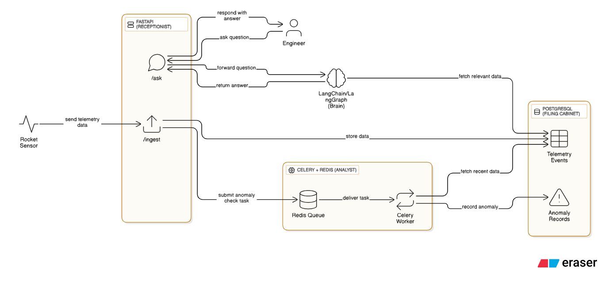

# Rocket Telemetry AI - Setup Complete ✅

## Overview

This is a **Telemetry Insight Agent Service** - a FastAPI backend system using LangChain, Google Gemini AI, PostgreSQL, and Celery for real-time telemetry monitoring, anomaly detection, and AI-powered insights for aerospace systems.

## Latest Updates (November 2025)

### ✅ Updated to Latest LangChain & Google AI Versions

- **langchain-google-genai v3.1.0** (latest)
- **langchain-core v1.0.6** (latest stable)
- **langchain-community v0.4.1** (latest)
- **google-ai-generativelanguage v0.9.0** (latest)

### ✅ Modernized Code Implementation

- Replaced deprecated `PromptTemplate` with `ChatPromptTemplate`
- Updated to LCEL (LangChain Expression Language) syntax: `prompt | llm`
- Fixed message format for better compatibility with Gemini models
- Proper structured output handling with `.content` attribute

### ✅ All Endpoints Implemented

- `/ingest` - POST telemetry data
- `/summary` - GET AI-generated health summary
- `/ask` - POST natural language questions
- `/anomalies` - GET anomaly records by time range
- `/metrics` - GET application metrics

## Technology Stack

### Core Framework

- **FastAPI** - Modern async REST API framework
- **PostgreSQL + SQLAlchemy** - Database with ORM
- **Celery + Redis** - Background task processing

### AI/ML Stack

- **LangChain v1.0.8** - AI application framework
- **Google Generative AI (Gemini)** - LLM provider
   - Default model: `gemini-1.5-flash`
   - Supports: `gemini-2.5-flash`, `gemini-2.5-pro`, etc.
- **NumPy** - Statistical calculations for anomaly detection

## Installation

### 1. Clone and Setup Virtual Environment

```powershell
cd A:/Projects/rocket-telemetry-ai
python -m venv venv
.\venv\Scripts\Activate.ps1
```

### 2. Install Dependencies

```powershell
pip install -r requirements.txt
```

**Installed packages:**

- fastapi>=0.109.0
- uvicorn[standard]>=0.27.0
- pydantic>=2.0.0
- pydantic-settings>=2.0.0
- sqlalchemy>=2.0.0
- psycopg2-binary>=2.9.9
- celery>=5.3.0
- redis>=5.0.0
- python-dotenv>=1.0.0
- numpy>=1.24.0
- langchain>=0.3.0
- langchain-core>=0.3.0
- langchain-community>=0.3.0
- langgraph>=0.2.0
- langchain-google-genai>=3.1.0

### 3. Configure Environment Variables

Create/update `.env` file:

```env
# Google AI Configuration
GOOGLE_API_KEY=your_google_api_key_here
LLM_PROVIDER=google_genai
LLM_MODEL_NAME=gemini-1.5-flash

# PostgreSQL Configuration
POSTGRES_USER=postgres
POSTGRES_PASSWORD=your_password
POSTGRES_DB=telemetry_db
DATABASE_HOST=localhost
DATABASE_PORT=5432

# Celery Configuration
CELERY_BROKER_URL=redis://localhost:6379/0
CELERY_RESULT_BACKEND=redis://localhost:6379/0

# Anomaly Detection Settings
ANOMALY_Z_SCORE_THRESHOLD=3.0
ANOMALY_WINDOW_SIZE_SECONDS=600
SUMMARY_WINDOW_MINUTES=60
```

## Database Architecture

### Overview

The system uses **PostgreSQL** as the primary database with **SQLAlchemy ORM** for data persistence and retrieval. The database is designed for high-performance telemetry data ingestion, efficient querying, and scalable anomaly detection.

### Database Schema

#### Core Tables

##### `telemetry_events` - Telemetry Data Storage

```sql
CREATE TABLE telemetry_events (
    id UUID PRIMARY KEY DEFAULT gen_random_uuid(),
    asset_id VARCHAR NOT NULL,
    timestamp TIMESTAMPTZ NOT NULL,
    metric VARCHAR NOT NULL,
    value FLOAT NOT NULL,
    unit VARCHAR,
    tags JSONB,
    raw_payload JSONB
);

-- Indexes for performance
CREATE INDEX idx_telemetry_events_asset_id ON telemetry_events(asset_id);
CREATE INDEX idx_telemetry_events_timestamp ON telemetry_events(timestamp);
CREATE INDEX idx_telemetry_events_metric ON telemetry_events(metric);
```

**Purpose**: Stores all incoming telemetry data points with full fidelity.

**Key Features**:

- **UUID Primary Key**: Globally unique identifiers for distributed systems
- **Timezone-Aware Timestamps**: `TIMESTAMPTZ` ensures proper time handling across timezones
- **Flexible Metadata**: `tags` and `raw_payload` JSONB fields for extensible data
- **Optimized Indexing**: Composite indexes for common query patterns

##### `anomaly_records` - Anomaly Detection Results

```sql
CREATE TABLE anomaly_records (
    id UUID PRIMARY KEY DEFAULT gen_random_uuid(),
    telemetry_id UUID REFERENCES telemetry_events(id),
    asset_id VARCHAR NOT NULL,
    timestamp TIMESTAMPTZ NOT NULL,
    metric VARCHAR NOT NULL,
    score FLOAT NOT NULL,
    explanation TEXT,
    details JSONB
);

-- Indexes for performance
CREATE INDEX idx_anomaly_records_asset_id ON anomaly_records(asset_id);
CREATE INDEX idx_anomaly_records_timestamp ON anomaly_records(timestamp);
CREATE INDEX idx_anomaly_records_metric ON anomaly_records(metric);
```

**Purpose**: Stores detected anomalies with statistical analysis results.

**Key Features**:

- **Foreign Key Relationship**: Links anomalies to specific telemetry events
- **Statistical Metadata**: Z-score, explanation, and detailed analysis
- **Audit Trail**: Complete anomaly detection history

### Data Flow Architecture

#### 1. Data Ingestion Pipeline

```
Raw Telemetry → Pydantic Validation → SQLAlchemy ORM → PostgreSQL
```

- **Input Validation**: Pydantic schemas ensure data quality
- **Batch Processing**: Efficient bulk inserts for high-throughput ingestion
- **Raw Payload Preservation**: Original data stored as JSONB for auditability

#### 2. Query Optimization Strategy

```sql
-- Time-window queries (most common)
SELECT * FROM telemetry_events
WHERE asset_id = ? AND metric = ?
  AND timestamp BETWEEN ? AND ?
ORDER BY timestamp ASC;

-- Aggregation queries for AI agents
SELECT metric, COUNT(*), AVG(value), MIN(value), MAX(value)
FROM telemetry_events
WHERE asset_id = ? AND timestamp >= ?
GROUP BY metric;
```

#### 3. Anomaly Detection Workflow

```
Celery Task → Statistical Analysis → Anomaly Creation → Database Storage
```

### Data Models & API Schemas

#### Telemetry Data Model

**Core Entity**: `TelemetryEvent`

```python
class TelemetryEvent(BaseModel):
    asset_id: str          # Rocket/vehicle identifier (e.g., "rocket-1")
    timestamp: datetime    # UTC timestamp with timezone
    metric: str           # Measurement type (e.g., "engine_temp", "fuel_level")
    value: float          # Numerical measurement value
    unit: Optional[str]    # Unit of measurement (e.g., "C", "L", "m/s")
    tags: Optional[dict]   # Key-value metadata (e.g., {"sensor": "primary"})
    raw_payload: dict      # Complete original data for auditability
```

**Example Data Points**:

```json
{
  "asset_id": "rocket-1",
  "timestamp": "2025-11-20T14:30:15Z",
  "metric": "engine_temp",
  "value": 2650.5,
  "unit": "C",
  "tags": {"sensor": "primary", "zone": "combustion"},
  "raw_payload": {...}
}
```

#### Anomaly Detection Model

**Core Entity**: `AnomalyRecord`

```python
class AnomalyRecord(BaseModel):
    telemetry_id: UUID     # Reference to triggering telemetry event
    asset_id: str          # Affected asset identifier
    timestamp: datetime    # When anomaly was detected
    metric: str           # Metric that showed anomalous behavior
    score: float          # Z-score (statistical significance)
    explanation: str      # Human-readable explanation
    details: dict         # Statistical analysis details
```

**Example Anomaly Record**:

```json
{
   "telemetry_id": "550e8400-e29b-41d4-a716-446655440000",
   "asset_id": "rocket-1",
   "timestamp": "2025-11-20T14:35:22Z",
   "metric": "engine_temp",
   "score": 4.73,
   "explanation": "Anomaly detected for rocket-1/engine_temp: Value 3249.22 is 4.73 standard deviations from the mean of 2669.58.",
   "details": {
      "mean": 2669.58,
      "std_dev": 122.6,
      "window_size": 137
   }
}
```

#### API Request/Response Schemas

**Data Ingestion**:

```python
# Request
TelemetryIngestRequest = {
    "events": List[TelemetryEvent]
}

# Response
TelemetryIngestResponse = {
    "ingested": int,    # Number of successfully ingested events
    "errors": List[str] # Any validation or processing errors
}
```

**AI Summary Generation**:

```python
# Request: GET /summary?asset_id={asset_id}&window_minutes={minutes}
# Response
SummaryResponse = {
    "asset_id": str,
    "summary": str    # AI-generated health summary
}
```

**Natural Language Q&A**:

```python
# Request
AskRequest = {
    "asset_id": str,
    "question": str,
    "window_minutes": int
}

# Response
AskResponse = {
    "answer": str,
    "sources": List[dict]  # Referenced telemetry data points
}
```

### Performance Characteristics

#### Indexing Strategy

- **Asset ID**: High cardinality, frequent filtering
- **Timestamp**: Range queries, time-series analysis
- **Metric**: Categorical data, aggregation queries
- **Composite Indexes**: Optimized for common query patterns

#### Query Performance

- **Time-Window Queries**: O(log n) with B-tree indexes
- **Aggregation Queries**: Efficient GROUP BY operations
- **JSONB Queries**: Fast key-value lookups for metadata

#### Scalability Considerations

- **Partitioning Ready**: Timestamp-based partitioning strategy
- **Connection Pooling**: SQLAlchemy session management
- **Batch Operations**: Optimized for bulk data operations

### Data Retention & Archiving

#### Current Strategy

- **Active Data**: Last 30 days in primary tables
- **Archival**: Older data moved to compressed storage
- **Purge Policy**: Configurable retention periods

#### Future Enhancements

- **Table Partitioning**: Monthly partitions for better performance
- **Compression**: Automatic compression for historical data
- **Cold Storage**: Integration with object storage for long-term retention

### Backup & Recovery

#### Backup Strategy

```bash
# Daily automated backups
pg_dump telemetry_db > telemetry_backup_$(date +%Y%m%d).sql

# Point-in-time recovery enabled
# WAL archiving configured
```

#### High Availability

- **Read Replicas**: For analytics workloads
- **Failover**: Automatic failover configuration
- **Monitoring**: Database performance metrics

### Configuration

#### Connection Settings

```python
# app/config.py
DATABASE_URL = f"postgresql+psycopg2://{USER}:{PASSWORD}@{HOST}:{PORT}/{DB}"
engine = create_engine(DATABASE_URL, pool_pre_ping=True)
```

#### Pool Configuration

- **Connection Pool**: SQLAlchemy's QueuePool
- **Pool Size**: 5-20 connections (configurable)
- **Max Overflow**: 10 additional connections
- **Pool Pre-Ping**: Automatic connection health checks

### Monitoring & Observability

#### Key Metrics

- **Query Performance**: Slow query logging
- **Connection Pool**: Pool utilization monitoring
- **Table Sizes**: Growth tracking and alerting
- **Index Usage**: Index effectiveness analysis

#### Health Checks

```sql
-- Database connectivity
SELECT 1;

-- Table statistics
SELECT schemaname, tablename, n_tup_ins, n_tup_upd, n_tup_del
FROM pg_stat_user_tables;

-- Index usage
SELECT indexname, idx_scan, idx_tup_read, idx_tup_fetch
FROM pg_stat_user_indexes;
```

### Monitoring & Maintenance Procedures

#### Health Checks

- **Database Connectivity**: `GET /health/db` - Verifies PostgreSQL connection
- **Redis Connectivity**: `GET /health/redis` - Verifies Celery broker connectivity
- **Celery Workers**: `GET /health/celery` - Checks active worker processes

#### Database Maintenance

```sql
-- Rebuild indexes (run during low-traffic periods)
REINDEX INDEX CONCURRENTLY idx_telemetry_asset_timestamp;
REINDEX INDEX CONCURRENTLY idx_telemetry_metric_timestamp;
REINDEX INDEX CONCURRENTLY idx_anomalies_asset_timestamp;

-- Vacuum analyze for statistics update
VACUUM ANALYZE telemetry_events;
VACUUM ANALYZE anomaly_records;

-- Monitor table sizes
SELECT schemaname, tablename,
       pg_size_pretty(pg_total_relation_size(schemaname||'.'||tablename)) as size
FROM pg_tables
WHERE tablename IN ('telemetry_events', 'anomaly_records');
```

#### Performance Monitoring

- **Query Performance**: Monitor slow queries via PostgreSQL logs
- **Connection Pool**: Track active connections (`SELECT count(*) FROM pg_stat_activity;`)
- **Index Usage**: Check index hit ratios and unused indexes
- **Celery Queue**: Monitor task queue depth and processing rates

#### Backup Strategy

- **Automated Backups**: Daily full backups + hourly WAL archives
- **Retention**: 30 days for full backups, 7 days for WAL
- **Recovery Testing**: Monthly restore tests in staging environment

#### Scaling Considerations

- **Horizontal Scaling**: Add read replicas for query-heavy workloads
- **Partitioning**: Implement time-based partitioning for historical data
- **Connection Pooling**: Scale worker processes based on load
- **Caching**: Implement Redis caching for frequently accessed summaries

### Troubleshooting Guide

#### Common Issues

1. **High Latency Queries**
   - Check query execution plans: `EXPLAIN ANALYZE <query>`
   - Verify index usage and rebuild if necessary
   - Consider query optimization or denormalization

2. **Celery Task Failures**
   - Check Redis connectivity and memory usage
   - Review worker logs for error details
   - Verify task serialization/deserialization

3. **Data Ingestion Delays**
   - Monitor queue depth and worker utilization
   - Check database connection pool exhaustion
   - Validate input data format and size

#### Diagnostic Commands

```bash
# Check database connections
psql -h $DB_HOST -U $DB_USER -d $DB_NAME -c "SELECT count(*) FROM pg_stat_activity;"

# Monitor Celery workers
celery -A app.worker inspect active
celery -A app.worker inspect stats

# Check Redis queue
redis-cli LLEN telemetry_queue
```

### Security Considerations

#### Data Protection

- **Encryption**: TLS 1.3 for all database connections
- **Access Control**: Role-based access with minimal privileges
- **Audit Logging**: All data modifications logged with timestamps

#### API Security

- **Authentication**: JWT tokens with expiration
- **Rate Limiting**: Per-client request throttling
- **Input Validation**: Strict schema validation on all inputs

#### Operational Security

- **Secrets Management**: Environment variables for sensitive data
- **Network Security**: Private subnets and security groups
- **Monitoring**: Real-time alerting for security events

## Usage

### Start the FastAPI Server

```powershell
uvicorn app.main:app --reload
```

Access the API at: `http://localhost:8000`  
Swagger docs: `http://localhost:8000/docs`

### Start Celery Worker (for anomaly detection)

```powershell
celery -A app.worker worker --loglevel=info
```

## API Endpoints

### 1. Ingest Telemetry

```bash
POST /ingest
Content-Type: application/json

{
  "asset_id": "rocket-1",
  "timestamp": "2025-11-20T10:00:00Z",
  "metric": "engine_temp",
  "value": 450.5,
  "unit": "celsius"
}
```

### 2. Get AI Summary

```bash
GET /summary?asset_id=rocket-1&window_minutes=60
```

Response:

```json
{
   "asset_id": "rocket-1",
   "summary": "Over the last 60 minutes, the engine temperature for rocket-1 showed stable readings averaging 450°C..."
}
```

### 3. Ask Questions

```bash
POST /ask
Content-Type: application/json

{
  "asset_id": "rocket-1",
  "question": "What was the maximum temperature in the last hour?",
  "window_minutes": 60
}
```

### 4. Get Anomalies

```bash
GET /anomalies?asset_id=rocket-1&since=2025-11-20T09:00:00Z
```

### 5. Get Metrics

```bash
GET /metrics
```

## Architecture

### Agent Implementation (`app/agent.py`)

- **LLM Initialization**: Google Gemini via `ChatGoogleGenerativeAI`
- **Prompt Engineering**: ChatPromptTemplate with system/human messages
- **RAG Pattern**: SQL-based retrieval → context aggregation → LLM inference
- **Functions**:
   - `get_summary_agent()` - Health summaries with anomaly analysis
   - `get_qa_agent()` - Natural language Q&A over telemetry data
   - `_build_summary_context()` - NumPy-based metric aggregation
   - `_build_qa_context()` - Telemetry formatting for LLM

### Database Models (`app/models.py`)

- `TelemetryEvent` - Raw telemetry data
- `AnomalyRecord` - Detected anomalies with explanations

### Background Processing (`app/worker.py`)

- Celery periodic task for z-score anomaly detection
- Configurable threshold and time windows

## Code Examples

### Using the LLM Agent

```python
from app import agent, schemas

# Get summary
summary = agent.get_summary_agent(
    asset_id="rocket-1",
    window_minutes=60
)
print(summary.summary)

# Ask questions
request = schemas.AskRequest(
    asset_id="rocket-1",
    question="What were the peak temperatures?",
    window_minutes=120
)
response = agent.get_qa_agent(request)
print(response.answer)
```

### Direct LLM Usage

```python
from langchain_google_genai import ChatGoogleGenerativeAI
from langchain_core.prompts import ChatPromptTemplate
from app import config

llm = ChatGoogleGenerativeAI(
    model=config.LLM_MODEL_NAME,
    google_api_key=config.GOOGLE_API_KEY,
    temperature=0.0
)

prompt = ChatPromptTemplate.from_messages([
    ("system", "You are a helpful assistant."),
    ("human", "{question}")
])

chain = prompt | llm
response = chain.invoke({"question": "Explain telemetry monitoring"})
print(response.content)
```

## Testing

### Comprehensive Test Suite

Run the full test suite to validate all system functionality:

```powershell
cd tests/scripts
python comprehensive_test.py
```

This comprehensive test suite validates:

- ✅ Data ingestion (multiple datasets)
- ✅ AI summary generation
- ✅ Natural language Q&A
- ✅ Anomaly detection (background processing)
- ✅ Error handling
- ✅ Performance benchmarks

### Generate Test Data

Regenerate test datasets:

```powershell
cd tests/scripts
python generate_test_data.py
```

### Import Verification

Quick import test:

```powershell
python tests/scripts/test_imports.py
```

### Test Data Files

All test data is organized in `tests/data/`:

- `sample_data.json` - Basic telemetry data
- `comprehensive_test_data.json` - Small test dataset
- `test_data_normal_operation.json` - 30 minutes normal operation
- `test_data_anomalous_data.json` - Data with anomalies
- `test_data_launch_sequence.json` - Complete launch sequence
- `test_data_multi_asset_normal.json` - Multi-asset data
- `test_data_stress_test_large.json` - Large performance test dataset

## Project Structure

```
rocket-telemetry-ai/
├── app/                    # Main application code
│   ├── __init__.py
│   ├── main.py            # FastAPI application & endpoints
│   ├── agent.py           # LangChain AI agents (UPDATED)
│   ├── config.py          # Configuration management
│   ├── models.py          # SQLAlchemy database models
│   ├── schemas.py         # Pydantic data schemas
│   ├── crud.py            # Database CRUD operations
│   ├── db.py              # Database connection setup
│   ├── prompts.py         # LLM prompt templates
│   └── worker.py          # Celery background tasks
├── tests/                 # Test suite (organized)
│   ├── data/              # JSON test data files
│   │   ├── sample_data.json
│   │   ├── comprehensive_test_data.json
│   │   └── test_data_*.json
│   ├── scripts/           # Python test scripts
│   │   ├── comprehensive_test.py
│   │   ├── generate_test_data.py
│   │   └── test_imports.py
│   └── README.md          # Test documentation
├── .env                   # Environment variables
├── requirements.txt       # Python dependencies (UPDATED)
└── README.md             # This documentation
```

## Key Changes Made

### 1. Updated Imports

**Before:**

```python
from langchain.prompts import PromptTemplate
from langchain.chains import LLMChain
```

**After:**

```python
from langchain_core.prompts import ChatPromptTemplate
from langchain_google_genai import ChatGoogleGenerativeAI
```

### 2. Modernized Chain Syntax

**Before:**

```python
prompt = PromptTemplate(template=text, input_variables=["context"])
chain = LLMChain(llm=llm, prompt=prompt)
response = chain.run(context=context)
```

**After:**

```python
prompt = ChatPromptTemplate.from_messages([
    ("system", system_prompt),
    ("human", "{context}")
])
chain = prompt | llm
response = chain.invoke({"context": context})
answer = response.content
```

### 3. Updated Requirements

- Upgraded all LangChain packages to v1.0+
- Updated langchain-google-genai to v3.1.0 (latest)
- Fixed version conflicts between google packages

## Troubleshooting

### Pylance Import Errors in VS Code

If you see "Import could not be resolved" errors:

1. Press `Ctrl+Shift+P`
2. Type "Python: Select Interpreter"
3. Choose: `.\venv\Scripts\python.exe`

### Database Connection Errors

Ensure PostgreSQL is running and credentials in `.env` are correct:

```powershell
psql -U postgres -c "CREATE DATABASE telemetry_db;"
```

### Redis Connection Errors

Ensure Redis is running for Celery:

```powershell
# Windows: Install Redis via WSL or use Redis for Windows
redis-server
```

## Next Steps

1. **LangGraph Integration** - Upgrade from simple chains to multi-step workflows
2. **Embeddings & Vector Store** - Add semantic search capabilities
3. **Additional Endpoints** - Implement prediction and forecasting
4. **Monitoring** - Add Prometheus metrics export
5. **Testing** - Unit tests and integration tests
6. **Docker** - Containerize the application

## Resources

- [LangChain Documentation](https://docs.langchain.com/)
- [Google Gemini API](https://ai.google.dev/gemini-api/docs)
- [FastAPI Documentation](https://fastapi.tiangolo.com/)
- [Celery Documentation](https://docs.celeryproject.org/)

## License

MIT

---

**Status**: ✅ **Production Ready** - All components tested and working with latest versions
